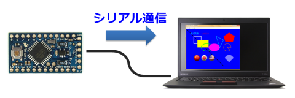
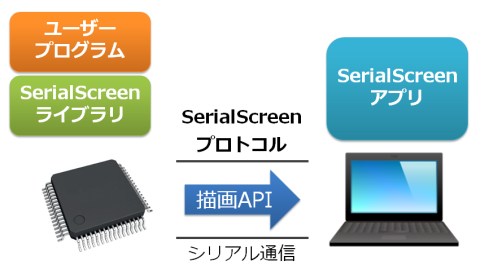
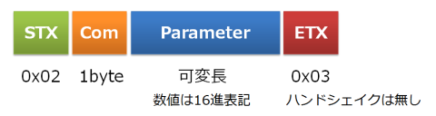
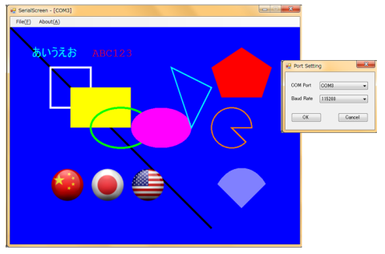

# SerialScreen (ベータ版)

[English README (英文ドキュメント)](https://github.com/lipoyang/SerialScreen/blob/master/README.md)

## はじめに



SerialScreenは、シリアル通信を介してマイコンからPCやタブレットに画面表示をおこなうためのツールです。このツールは、マイコン用ライブラリおよびPC/タブレット用アプリからなります。

ローエンドのマイコンは、メモリ容量やI/Oピン数、処理速度などの不足から、グラフィックLCDを駆動できないことがあります。あるいは、部品コストが高い・寸法が大きいなどの理由でLCDを採用したくない場合もあるでしょう。このツールは、そのような低コスト・小サイズのシステムに仮想の画面を提供します。

* ライブラリはC++による実装。
* 抽象化されたシリアルポートを実装することでお好みのマイコンで利用可。
* Linux, Arduino, mbed に移植済み。
* いまのところ、アプリはWindowsデスクトップ版のみ。
* Android版アプリの実装を検討中。 誰か作ってください(^^;

## アーキテクチャ



## SerialScreenプロトコル

### シリアル通信

* Data 8bit, Non-Parity, Stop 1bit
* Baud Rate: 9600/19200/38400/57600/115200
* フロー制御無し　信号線はRxD/TxDのみ

### アスキー形式の電文



## SerialScreenライブラリ

SerialScreenライブラリはC++で実装されています。

### Color型
色指定に用いる24ビットの整数値。形式は`0xRRGGBB`。

### Point型
多角形の座標指定に用いる構造体。メンバは整数値の`x`および`y`。

### SerialScreenクラス
#### 公開メソッド
|メソッド|説明|
|:--|:--|
|`open()`<br>`open(baud)`<br>`open(port, baud)`|シリアルポート(`port`)を開き、ボーレートを`baud`に設定する。成功したら`true`を返す。|
|`close()`|シリアルポートを閉じる。|
|`isOpen()`|シリアルポートが開いているか？|
|`setScreen(w, h)`|画面サイズを設定する。`w`:幅[ピクセル], `h`:高さ[ピクセル]|
|`clearScreen(color)`|画面を指定した色(`color`)で塗りつぶす。|
|`setColor(color, width)`|描画色(`color`)とペンの太さ(`width`)を設定する。|
|`drawLine(x1, y1, x2, y2)`|`点(x1, y1)`から点`(x2, y2)`まで直線を描く。|
|`drawRectangle(x, y, w, h)`|座標`(x, y)`, 幅`w`, 高さ`h`で指定される長方形を描く。|
|`fillRectangle(x, y, w, h)`|座標`(x, y)`, 幅`w`, 高さ`h`で指定される長方形を塗りつぶす。|
|`drawPolygon(num, points)`|Point構造体の配列`points`で指定される多角形を描く。`points`の要素数は`num`で指定する。|
|`fillPolygon(num, points)`|Point構造体の配列`points`で指定される多角形を塗りつぶす。`points`の要素数は`num`で指定する。|
|`drawCircle(x, y, w, h)`|座標`(x, y)`, 幅`w`, 高さ`h`で指定される円/楕円を描く。|
|`fillCircle(x, y, w, h)`|座標`(x, y)`, 幅`w`, 高さ`h`で指定される円/楕円を塗りつぶす。|
|`drawPie(x, y, w, h, start, sweep)`|座標`(x, y)`, 幅`w`, 高さ`h`で指定される円/楕円と、開始角`start` [deg], 回転角`sweep` [deg] で指定される2本の放射線で定義される扇形を描く。|
|`fillPie(x, y, w, h, start, sweep)`|座標`(x, y)`, 幅`w`, 高さ`h`で指定される円/楕円と、開始角`start` [deg], 回転角`sweep` [deg] で指定される2本の放射線で定義される扇形を塗りつぶす。|
|`setFont(size)`|文字の大きさ(`size`)をピクセル数で設定する。|
|`drawString(x, y, s)`|座標`(x, y)`に文字列`s`を描く。|
|`drawImage(x, y, index)`|座標`(x, y)`に、`index`で指定された画像を描く。|
|`loadImage(index, path)`|`path`の画像ファイルを読み込んで、画像を`index`と関連づける。|

#### 公開定数
|定数|説明|
|:--|:--|
|BLACK|色の定数。0x000000 (黒)|
|RED|色の定数。0xFF0000 (赤)|
|GREEN|色の定数。0x00FF00 (緑)|
|BLUE|色の定数。0x0000FF (青)|
|YELLOW|色の定数。0xFFFF00 (黄色)|
|CYAN|色の定数。0x00FFFF (水色)|
|MAGENTA|色の定数。0xFF00FF (紫色)|
|WHITE|色の定数。0xFFFFFF (白)|
|GRAY|色の定数。0x808080 (灰色)|

### ライブラリの移植
SerialScreenライブラリでは、シリアルポートは`SerialPort`クラスとして抽象化されています。`SerialPort`クラスを実装することで、お使いのマイコンにライブラリを移植することができます。そのためには下記の公開メソッドを実装する必要があります。

### SerialPortクラス

|メソッド|説明|
|:--|:--|
|`SerialPort()`|コンストラクタ|
|`~SerialPort()`|デストラクタ|
|`open()`<br>`open(baud)`<br>`open(port, baud)`|シリアルポート(`port`)を開き、ボーレートを`baud`に設定する。成功したら`true`を返す。|
|`close()`|シリアルポートを閉じる。|
|`isOpen()`|シリアルポートが開いているか？|
|`read(buff, len)`|今のところ未使用。シリアルポートから`len`バイトのデータを読んで、`buff`に格納する。|
|`write(buff, len)`|`buff`に格納されれいる`len`バイトのデータをシリアルポートに書く。|

## サンプルコード

mbedで動作するサンプルコードを示します。

```cpp
#include "mbed.h"
#include "SerialScreen.h"

Serial usbSerial(USBTX, USBRX);
SerialScreen ss;

int main(void)
{
    // シリアルポートを開く
    ss.open(&usbSerial, 9600 );
    
    // 画面サイズを設定し、塗りつぶす
    ss.setScreen(720,540);
    ss.clearScreen(ss.BLUE);
    
    // 長方形を描く
    ss.setColor(ss.RED, 5);
    ss.drawRectangle(100,100,100,100);
    
    // 多角形を描く
    ss.setColor(ss.GREEN,3);
    Point triangle[3] ={{400,100}, {450,250}, {500,150}};
    ss.drawPolygon(3,triangle);
    
    // 文字列を描く
    ss.setFont(20);
    ss.setColor(ss.CYAN,5);
    ss.drawString(50,50,"Hello, world!");
    
    // 画像を描く
    ss.loadImage(0, "image.png");
    ss.drawImage(100, 350, 0);
    
    while(true)
    {
        ;
    }
    
    // シリアルポートを閉じる
    ss.close();
    
    return 0;
}
```

## SerialScreenアプリ

今のところ、Windowsデスクトップアプリのみ実装されています。C#で記述された.NETアプリです。
Android版アプリの実装を検討中です。



## ファイル構成

- app/: SerialScreenアプリのソース
    - win/: Windowsデスクトップアプリのソース
- lib/: SerialScreenライブラリのソース
    - common/: 共通のソース
    - linux/: Linuxへの移植
    - arduino/: Arduinoへの移植
    - mbed/: mbedへの移植
- LICENSE: Apache Licence 2.0です
- README.md: 英文ドキュメント
- README-ja.md: 和文ドキュメント
- image/: ドキュメントに掲載の画像

---

&copy; 2015 Bizan Nishimura. All Rights Reserved.

