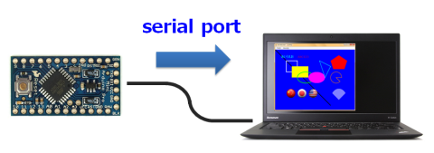
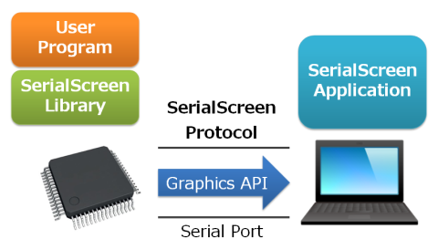
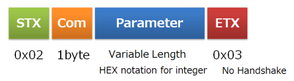

# SerialScreen (Beta Version)

[Japanese README (和文ドキュメント)](https://github.com/lipoyang/SerialScreen/blob/master/README-ja.md)

## Introduction



The SerialScreen is a tool for microcontrollers(MCU) to display graphics on PC/tablet screen via serial port. This tool is consist of the library for MCU and the application for PC/tablet.

Due to insufficient memory, I/O pins or CPU power, some of low-end MCUs can not drive graphic LCD. In some cases, you may not want LCD display due to high cost or huge size. This tool provides virtual graphic screen to such low cost and small size systems.

* The library is written in C++.
* The library has been ported to Linux, Arduino, and mbed.
* You can port this library to your MCU by implementing the serial port interface.
* At the moment, the application is only available on Windows.
* The application for Android is under consideration. Would you develop it? :)

## Architecture



## SerialScreen Protocol

### Serial Communication

* Data 8bit, Non-Parity, Stop 1bit
* Baud rate: 9600/19200/38400/57600/115200
* No flow control, only use RxD/TxD

### ASCII format telegram



## SerialScreen Library

The SerialScreen library is implemented in C++.

### Color Type
The `Color` type is 24 bit integer used to specify RGB colors. The color format is `0xRRGGBB`.

### Point Structure
The `Point` structure is used to specify coordinates of apexes of a poligon. The members are integer value `x` and `y`.

### SerialScreen Class
#### Public Methods
|Method|Description|
|:--|:--|
|`open()`<br>`open(baud)`<br>`open(port, baud)`|opens a serial port (`port`), and sets the baud rate to `baud`. returns `true` if successful.|
|`close()`|closes the serial port.|
|`isOpen()`|is the serial port open or not?|
|`setScreen(w, h)`|sets this screen size. `w`:width[pixel], `h`:height[pixel]|
|`redraw()`|redraws the screen.|
|`clearScreen(color)`|fills the screen with a given (`color`).|
|`setColor(color, width)`|sets the color (`color`), and sets the width of the pen (`width`).|
|`drawLine(x1, y1, x2, y2)`|draws a line between points `(x1, y1)` and `(x2, y2)`.|
|`drawRectangle(x, y, w, h)`|draws a rectangle specified by a coordinate `(x, y)`, a width `w`, and a height `h`.|
|`fillRectangle(x, y, w, h)`|fills a rectangle specified by a coordinate `(x, y)`, a width `w`, and a height `h`.|
|`drawPolygon(num, points)`|draws a polygon specified by `points`, which is an array of `Point` structures. number of elements in `points` is specified by `num`.|
|`fillPolygon(num, points)`|fills a polygon specified by `points`, which is an array of `Point` structures. number of elements in `points` is specified by `num`.|
|`drawCircle(x, y, w, h)`|draws a circle/ellipse specified by a coordinate `(x, y)`, a width `w`, and a height `h`.|
|`fillCircle(x, y, w, h)`|fills a circle/ellipse specified by a coordinate `(x, y)`, a width `w`, and a height `h`.|
|`drawPie(x, y, w, h, start, sweep)`|draws a pie shape defined by an circle/ellipse specified by a coordinate `(x, y)`, a width `w`, and a height `h`, and two radial lines specified by starting angle `start` [deg] and sweeping angle `sweep` [deg].|
|`fillPie(x, y, w, h, start, sweep)`|fills a pie shape defined by an circle/ellipse specified by a coordinate `(x, y)`, a width `w`, and a height `h`, and two radial lines specified by starting angle `start` [deg] and sweeping angle `sweep` [deg].|
|`setFont(size)`|sets the font size to `size` pixels.|
|`drawString(x, y, s)`|draws the specified text string `s` at the specified coordinate `(x, y)`|
|`drawImage(x, y, index)`|draws the image specified by `index` at the specified coordinate `(x, y)`|
|`loadImage(index, path)`|load a image file specified by `path`, and associates the image with `index`.|

#### Public Constants
|Constant|Description|
|:--|:--|
|BLACK|Color constant. 0x000000 (Black)|
|RED|Color constant. 0xFF0000 (Red)|
|GREEN|Color constant. 0x00FF00 (Green)|
|BLUE|Color constant. 0x0000FF (Blue)|
|YELLOW|Color constant. 0xFFFF00 (Yellow)|
|CYAN|Color constant. 0x00FFFF (Cyan)|
|MAGENTA|Color constant. 0xFF00FF (Magenta)|
|WHITE|Color constant. 0xFFFFFF (White)|
|GRAY|Color constant. 0x808080 (Gray)|

### How to port this library

The SerialScreen library abstracts serial ports by `SerialPort` class. You can port this library to your MCU by implementing `SerialPort` class. The public methods of `SerialPort` class shown below must be implemented.

### SerialPort Class

|Method|Description|
|:--|:--|
|`SerialPort()`|the constructor|
|`~SerialPort()`|the destructor|
|`open()`<br>`open(baud)`<br>`open(port, baud)`|opens a serial port(`port`), and sets the baudrate to `baud`. returns `true` if successful.|
|`close()`|closes the serial port.|
|`isOpen()`|is the serial port open or not?|
|`read(buff, len)`|attempts to read up to `len` bytes from the serial port into the buffer pointed by `buff`. At the moment, it is not in use. |
|`write(buff, len)`|writes up to `len` bytes from the buffer pointed by `buff` to the serial port.|

## Sample Code

Here is a sample code for mbed.

```cpp
#include "mbed.h"
#include "SerialScreen.h"

Serial usbSerial(USBTX, USBRX);
SerialScreen ss;

int main(void)
{
    // open the USB serial port
    ss.open(&usbSerial, 9600 );

    // set the screen size, and black it out
    ss.setScreen(720,540);
    ss.clearScreen(ss.BLACK);

    // draw a rectangle
    ss.setColor(ss.RED, 5);
    ss.drawRectangle(100,100,100,100);

    // draw a polygon
    ss.setColor(ss.GREEN,3);
    Point triangle[3] ={{400,100}, {450,250}, {500,150}};
    ss.drawPolygon(3,triangle);

    // draw a string
    ss.setFont(20);
    ss.setColor(ss.CYAN,5);
    ss.drawString(50,50,"Hello, world!");

    // draw a image
    ss.loadImage(0, "image.png");
    ss.drawImage(100, 350, 0);

    // redraw the screen
    ss.redraw();

    while(true)
    {
        ;
    }

    // close the USB serial port
    ss.close();

    return 0;
}
```

## SerialScreen Application

At the moment, the application only for Windows has been implemented. This is .NET desktop application written in C#.
The application for Android is under consideration.


## File List

- app/: SerialScreen application
    - win/: Windows desktop application
- lib/: SerialScreen library
    - common/: common source files
    - linux/: port to Linux
    - arduino/: port to Arduino
    - mbed/: port to mbed
- LICENSE: Apache Licence 2.0
- README.md: English document
- README-ja.md: Japanese document
- image/: images for documents

---

&copy; 2015 Bizan Nishimura. All Rights Reserved.
